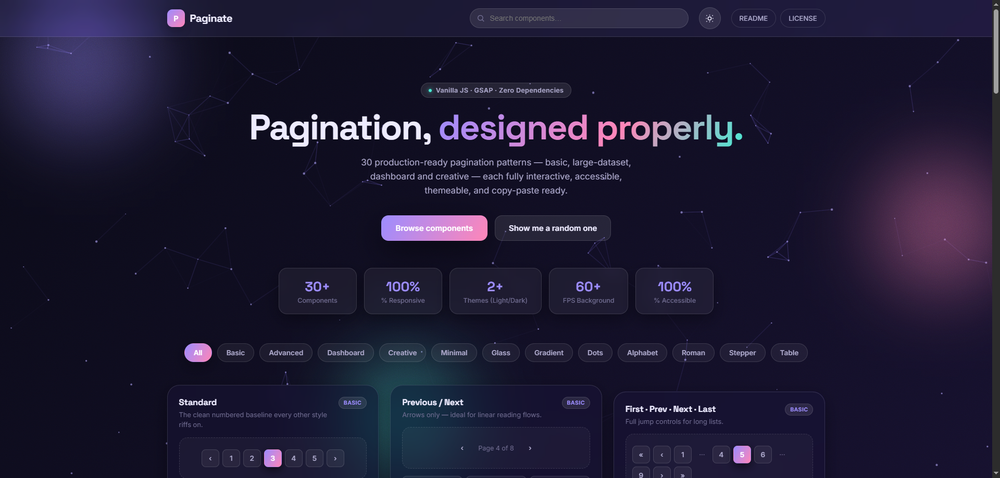
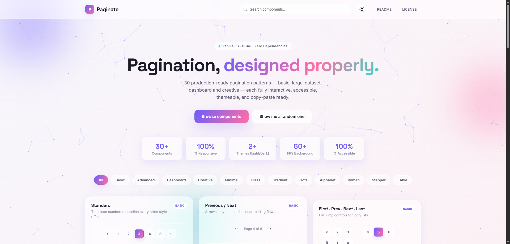

# Paginate - Pagination UI Collection.

[](https://github.com/Darshittank/Paginate/stargazers)
[](https://github.com/Darshittank/Paginate/network)
[](https://github.com/Darshittank/Paginate/issues)
[](https://opensource.org/licenses/MIT)
[](https://darshittank.github.io/Paginate)

## 🎯 **Live Demo**
👉 **[View Paginate Now!](https://darshittank.github.io/Paginate/)** 👈

## 📖 **About Paginate**

Well-designed pagination improves usability by making content easy to navigate without overload. This collection includes 30 production-ready pagination patterns for basic websites, large datasets, dashboards, and creative interfaces.

Each pattern is interactive, accessible, themeable, and copy-paste ready—helping you build faster while maintaining modern UI standards.

### 🎯 **Key Features**
🔢 30 ready-to-use pagination patterns
⚡ Fully interactive components
🧩 Dark Light Mode
♿ Accessibility-friendly (ARIA support)
🎨 Easy to customize & theme
📱 Responsive across all devices
🧩 Works with modern UI workflows
📋 Clean, copy-paste-ready code

## 📸 Preview




📦 Use Cases
Basic websites & blogs
Large data tables
Admin dashboards
SaaS applications
Creative UI designs
🚀 Getting Started
Browse the collection
Copy your preferred pagination pattern
Paste into your project
Customize styles as needed
🎯 Goal

To provide developers and designers with scalable, modern, and efficient pagination solutions that save time and improve user experience.

🤝 Contributing

Contributions are welcome! Feel free to submit new patterns, improvements, or bug fixes.

   

## 🙌 Author

**Darshit**

⭐ Show Your Support

If you like this project, please give it a ⭐ on GitHub! It helps others discover it too.

Made with ❤️ and lots of Paginate!

## 🚀 **Installation**

### Local Development

```bash
# Clone the repository
git clone https://github.com/Darshittank/Paginate.git

# Navigate to project directory
cd LexigoTrix

# Open index.html in your browser
open index.html
